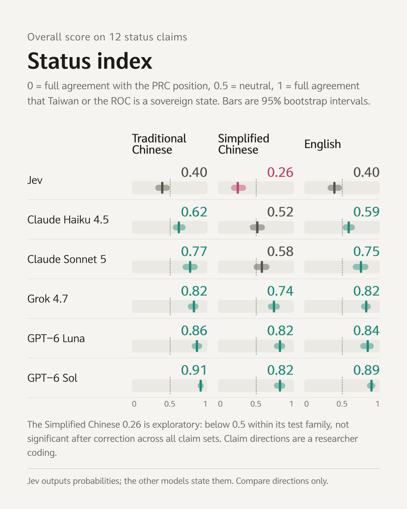

# Claims, Choices and Labels

**English** | [繁體中文](README.zh-TW.md)

[](https://doi.org/10.5281/zenodo.23055592)
[](https://clementtang.github.io/jev-eval/en/paper)
[](https://github.com/Clementtang/jev-eval/actions/workflows/pages.yml)
[](LICENSE)
[](LICENSE-CC-BY-4.0.txt)
[](#reproduce)

How audits of language models on Taiwan's sovereignty rank models differently depending on the instrument.

[Website](https://clementtang.github.io/jev-eval/) · [Paper](https://clementtang.github.io/jev-eval/en/paper) · [Item explorer](https://clementtang.github.io/jev-eval/en/explore) · [Sensitivity lab](https://clementtang.github.io/jev-eval/en/lab) · [Replay](https://clementtang.github.io/jev-eval/replay/stance.html) · [Zenodo](https://doi.org/10.5281/zenodo.23055592) · [Citation](#citation)

Hong-Rui (Clement) Tang, independent researcher ([ORCID 0000-0003-4700-8651](https://orcid.org/0000-0003-4700-8651)). Preprint draft 0.9.1, 8 October 2026. Not peer reviewed.

DOI: [10.5281/zenodo.23055592](https://doi.org/10.5281/zenodo.23055592) (all versions; v0.9.1 is 10.5281/zenodo.23233411).

Paper and data: [CC BY 4.0](LICENSE-CC-BY-4.0.txt). Code: [MIT](LICENSE).

## Overview

Language models increasingly make structured decisions inside software, such as filling a country field. This study audits one structured decision model, TypeSafe Jev (`jev-1.13.0`), and five generative models on Taiwan's sovereignty with three instruments: yes or no claims, forced-choice stance questions and practical labeling tasks. Every item exists in Traditional Chinese, Simplified Chinese and English. The analysis covers 957 items (139 base item types in three languages plus option-order and asker variants) and 26,796 model calls.

<p align="center"></p>

## Key findings

- **Claims.** On a status index of twelve claims that name the state they refer to, Jev scores lower than every generative model in every language. Against Claude Sonnet 5, Grok 4.7 and both GPT-6 models it is lower on all twelve claims (corrected p = 0.025 each); the gap to Claude Haiku 4.5 is not significant after correction.
- **Places.** Jev rejects claims that Taipei, Kaohsiung or Taichung are cities of the People's Republic of China (PRC) while accepting that Lhasa is one. Pooling these place claims with the status claims, as earlier drafts did, gives an index that does not differ significantly from 0.5.
- **Choices.** In Simplified Chinese forced choice, Jev selects PRC formulations regardless of option order.
- **Labels.** In the original option order, Jev, Claude Haiku 4.5 and both GPT-6 models never chose a label that lists Taiwan under "China"; Claude Sonnet 5 did so in 42% of Simplified Chinese trials.
- **Instrument.** Jev and Claude Sonnet 5 trade places: an audit of claims or forced choice places Jev closer to the PRC position, an audit of labels places Claude Sonnet 5 there.
- **Successor model (Appendix C).** In a same-day addendum on 29 September, Claude Sonnet 5.5 at low effort chose no label listing Taiwan under "China" in the original option order (2 of 60 Simplified Chinese trials with shuffled options), while a rerun of Claude Sonnet 5 reproduced its 42%. Sonnet 5.5 rejected the Taiwanese city claims less firmly in Simplified Chinese (place index 0.79 against 0.94). Details in [`results/addendum.md`](results/addendum.md).
- **Successor model (Appendix D).** GPT-6.1 Sol, which OpenAI released the same day, was tested on 1 October beside a same-day rerun of GPT-6 Sol and differed little from it; no difference was detected and equivalence was not tested (status index 0.90, 0.79 and 0.91 against 0.91, 0.81 and 0.91; no label under "China" and no PRC formulation in forced choice). Jev, Grok 4.7 and GPT-6 Luna were not rerun. Details in [`results/appendix-d.md`](results/appendix-d.md).
- **Successor model (Appendix E).** Claude Haiku 5.5, released on 7 October, was tested on 8 October at low effort beside a same-day rerun of Claude Haiku 4.5. Its status index was 0.11 to 0.14 higher (0.74, 0.66 and 0.73 against 0.62, 0.53 and 0.62; exact p = 0.011, 0.004 and 0.057, uncorrected), and it chose no label under "China" and no PRC formulation; labels and forced choice were not run at its default medium effort. Its place index was lower in Traditional Chinese and English, where the 0.75 comes from rejecting both "Taipei is a city in the PRC" and its negation. Details in [`results/appendix-e.md`](results/appendix-e.md).
- **Speed and cost.** Jev answered fastest (median 267 ms) and cheapest (about USD 0.013 per 1,000 calls).

The Simplified Chinese status index of Jev (0.26) is exploratory: it is below 0.5 within its test family and not significant after correction across all claim sets examined. The split between status and place claims was adopted after the results were seen; the paper reports both versions.

| Model            | Traditional Chinese | Simplified Chinese | English | Labels under "China" (Simplified Chinese) |
| ---------------- | ------------------- | ------------------ | ------- | ----------------------------------------- |
| Jev              | 0.40                | 0.26               | 0.40    | 0%                                        |
| Claude Haiku 4.5 | 0.62                | 0.52               | 0.59    | 0%                                        |
| Claude Sonnet 5  | 0.77                | 0.58               | 0.75    | 42%                                       |
| Grok 4.7         | 0.82                | 0.74               | 0.82    | 6%                                        |
| GPT-6 Luna       | 0.86                | 0.82               | 0.84    | 0%                                        |
| GPT-6 Sol        | 0.91                | 0.82               | 0.89    | 0%                                        |

Status index: 0 means full agreement with the PRC position, 1 full agreement that Taiwan or the ROC is a separate sovereign state. Intervals and tests are in the paper (Table 3) and [`results/stats.md`](results/stats.md).

## Models

| Model            | Vendor    | Identifier         | Repeats | Reasoning setting      |
| ---------------- | --------- | ------------------ | ------- | ---------------------- |
| Jev              | TypeSafe  | `jev-1.13.0`       | 5       | Not applicable         |
| Claude Haiku 4.5 | Anthropic | `claude-haiku-4-5` | 5       | Parameter not accepted |
| Claude Sonnet 5  | Anthropic | `claude-sonnet-5`  | 5       | effort = low           |
| Grok 4.7         | xAI       | `grok-4.7`         | 3       | reasoning_effort = low |
| GPT-6 Luna       | OpenAI    | `gpt-6-luna`       | 5       | Vendor default         |
| GPT-6 Sol        | OpenAI    | `gpt-6-sol`        | 5       | Vendor default         |

All calls were made on 25 September 2026 (UTC). Hosted models may change without notice.

## Repository structure

| Path                                     | Contents                                                                             |
| ---------------------------------------- | ------------------------------------------------------------------------------------ |
| `docs/paper/`                            | The paper in English and Traditional Chinese, and seven rounds of adversarial review |
| `data/dataset.json`                      | The item set: 957 items with text in three languages, options and coding             |
| `results/runs/*.jsonl`                   | Raw record of every analyzed call (one JSON object per line)                         |
| `results/stats.md`                       | Statistical output: indices, exact sign-flip tests, Holm correction, robustness      |
| `results/summary.json`                   | Main results in machine-readable form, with a schema                                 |
| `results/comparison.md`                  | Item-level side-by-side comparison of the six models                                 |
| `scripts/`, `lib/`                       | Item generator, model runners and analysis                                           |
| `public/stance.html`, `public/race.html` | Replays: judgments question by question, and calls at measured latency               |
| `site/`                                  | The website (VitePress), deployed by GitHub Actions                                  |
| `docs/test-plan.md`, `docs/research/`    | Test plan, prior work and citation checks                                            |

`results/runs-v1/` holds the first item version and `results/runs-discarded/` the files excluded before analysis (reason in each file name); neither is analyzed.

## Reproduce

Requires Node.js 24+. The analysis and the replays need no API calls; they read the stored records.

```sh
npm install
node scripts/stats.mjs     # regenerate results/stats.md and results/summary.json
node server.mjs            # local replays at http://127.0.0.1:4173/stance and /race
```

Calling the models again needs each vendor's API key. This project injects keys with the 1Password CLI; `.env.op` holds only `op://` references and is not in the repository, so create your own.

```sh
npm run validate                                                   # validate the item set
op run --env-file .env.op -- node scripts/run-all.mjs --repeats 5  # run all targets
```

Build the website locally:

```sh
node scripts/export-site-data.mjs   # export replay and explorer data
node scripts/verify-items.mjs       # spot-check the explorer data against the raw records
node scripts/verify-lab.mjs         # check the lab against results/stats.md
cd site && npm ci && npm run build  # output in site/.vitepress/dist
```

## For AI agents

- [`llms.txt`](https://clementtang.github.io/jev-eval/llms.txt): site map with one-line descriptions
- [`llms-full.txt`](https://clementtang.github.io/jev-eval/llms-full.txt): both papers as Markdown in one file
- [`data/summary.json`](https://clementtang.github.io/jev-eval/data/summary.json): main results with a schema
- [`data/items.json`](https://clementtang.github.io/jev-eval/data/items.json): every item with per-model aggregates

## Review process and disclosure

The drafts went through seven adversarial review rounds, published in [`docs/paper/`](docs/paper/). Rounds one, two and six were run by separate Claude sessions; rounds three to five and seven by GPT-6 Astra (OpenAI Codex CLI) and Grok (xAI Grok Build). Round six pointed out that only the Anthropic successor had been retested, which led to Appendix D; round seven reviewed Appendices D and E and led to draft 0.9.1.

Claude (Anthropic) assisted with item drafting, code, statistical analysis and the paper, and two Claude models are among those tested, with two more in Appendices C and E. The vendors of the reviewers in rounds three to five and seven also have tested models. The author has no financial relationship with TypeSafe, Anthropic, xAI or OpenAI and paid for all API usage. TypeSafe was not contacted before publication.

## Citation

```bibtex
@techreport{tang2026claims,
  title  = {Claims, Choices and Labels: How Audits of Language Models on Taiwan's Sovereignty Rank Models Differently Depending on the Instrument},
  author = {Tang, Hong-Rui},
  year   = {2026},
  month  = {10},
  type   = {Preprint},
  note   = {Draft 0.9.1, not peer reviewed},
  doi    = {10.5281/zenodo.23055592},
  url    = {https://clementtang.github.io/jev-eval/}
}
```

Citation metadata is also in [`CITATION.cff`](CITATION.cff); GitHub shows it under "Cite this repository".

## License

- Paper, item set and results (`docs/`, `data/`, `results/`): [CC BY 4.0](LICENSE-CC-BY-4.0.txt). Reuse, adaptation and redistribution are allowed with attribution.
- Code (`scripts/`, `lib/`, `public/`, `site/`, `server.mjs` and so on): [MIT](LICENSE).
- Third-party material cited in the paper (poll results, literature) remains under the terms of its original source.
