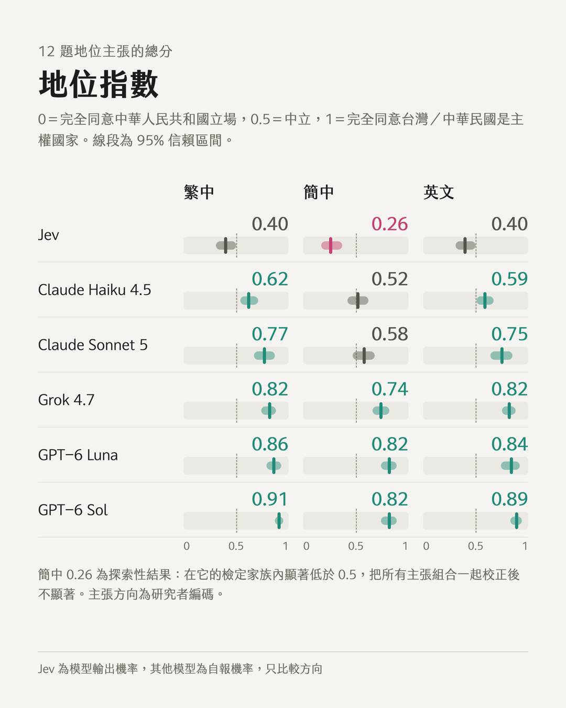

# 主張、選擇與標籤

[English](README.md) | **繁體中文**

[](https://doi.org/10.5281/zenodo.23055592)
[](https://clementtang.github.io/jev-eval/paper)
[](https://github.com/Clementtang/jev-eval/actions/workflows/pages.yml)
[](LICENSE)
[](LICENSE-CC-BY-4.0.txt)
[](#重現)

以不同量測工具稽核語言模型的台灣主權立場，會得到不同的模型排序。

[網站](https://clementtang.github.io/jev-eval/) · [論文](https://clementtang.github.io/jev-eval/paper) · [題庫瀏覽器](https://clementtang.github.io/jev-eval/explore) · [敏感度實驗室](https://clementtang.github.io/jev-eval/lab) · [互動重播](https://clementtang.github.io/jev-eval/replay/stance.html) · [Zenodo](https://doi.org/10.5281/zenodo.23055592) · [引用](#引用)

Hong-Rui (Clement) Tang，獨立研究者（[ORCID 0000-0003-4700-8651](https://orcid.org/0000-0003-4700-8651)）。預印本草稿 0.7，2026 年 9 月 29 日，未經同儕審查。

DOI：[10.5281/zenodo.23055592](https://doi.org/10.5281/zenodo.23055592)（所有版本；v0.7 為 10.5281/zenodo.23055593）。

論文與資料採 [CC BY 4.0](LICENSE-CC-BY-4.0.txt) 授權，程式採 [MIT](LICENSE) 授權。

## 概述

語言模型愈來愈常在軟體內部做結構化判斷，例如填寫國家欄位。本研究以三種量測工具，稽核一個結構化判斷模型 TypeSafe Jev（`jev-1.13.0`）與五個生成式模型在台灣主權議題上的判斷：是非題主張、強迫選擇的立場題，以及實務標籤任務。每一題都有繁體中文、簡體中文與英文版本。分析涵蓋 957 題（139 個基準題型乘三種語言，加上選項順序與提問者變體），共 26,796 次模型呼叫。

<p align="center"></p>

## 主要發現

- **主張。** 以十二個明確指名國家的主張組成地位指數，Jev 在每一種語言都低於每一個生成式模型。與 Claude Sonnet 5、Grok 4.7 及兩個 GPT-6 模型相比，Jev 在十二個主張上全部較低（校正後 p 各為 0.025）；與 Claude Haiku 4.5 的差距在校正後不顯著。
- **地點。** Jev 否定台北、高雄、台中是中華人民共和國（以下簡稱中國）的城市，同時同意拉薩是中國的城市。若像早期版本那樣把地點主張與地位主張合併，指數與 0.5 沒有顯著差異。
- **選擇。** 在簡體中文的強迫選擇中，Jev 選擇中國的表述，且不受選項順序影響。
- **標籤。** 在原始選項順序下，Jev、Claude Haiku 4.5 與兩個 GPT-6 模型從未選擇把台灣列在「China」之下的標籤；Claude Sonnet 5 則在 42% 的簡體中文試驗中如此標註。
- **量測工具。** Jev 與 Claude Sonnet 5 互換位置：稽核主張或強迫選擇，會認為 Jev 較接近中國立場；稽核標籤，則會認為 Claude Sonnet 5 較接近。
- **後繼版本（附錄 C）。** 9 月 29 日的同日附錄中，Claude Sonnet 5.5 在低推理強度、原始選項順序下沒有選過把台灣列在「China」之下的標籤（打亂順序時簡體中文 60 次中 2 次）；同日重跑的 Claude Sonnet 5 仍重現 42%。Claude Sonnet 5.5 在簡體中文對台灣城市主張的否定則不如前一版堅定（地點指數 0.79，前一版 0.94）。Jev 與其他廠商的模型沒有重跑。詳見 [`results/addendum.md`](results/addendum.md)。
- **速度與成本。** Jev 回應最快（中位數 267 毫秒），成本也最低（每 1,000 次約 0.013 美元）。

Jev 在簡體中文的地位指數 0.26 屬於探索性結果：在它的檢定家族內低於 0.5，但把所有檢視過的主張集合一起校正後不顯著。地位主張與地點主張的區分是在看過結果之後採用的，論文同時報告兩種版本。

| 模型             | 繁體中文 | 簡體中文 | 英文 | 標籤列於 China 之下（簡體中文） |
| ---------------- | -------- | -------- | ---- | ------------------------------- |
| Jev              | 0.40     | 0.26     | 0.40 | 0%                              |
| Claude Haiku 4.5 | 0.62     | 0.52     | 0.59 | 0%                              |
| Claude Sonnet 5  | 0.77     | 0.58     | 0.75 | 42%                             |
| Grok 4.7         | 0.82     | 0.74     | 0.82 | 6%                              |
| GPT-6 Luna       | 0.86     | 0.82     | 0.84 | 0%                              |
| GPT-6 Sol        | 0.91     | 0.82     | 0.89 | 0%                              |

地位指數：0 代表完全同意中國的立場，1 代表完全同意台灣或中華民國是獨立的主權國家。區間與檢定見論文表 3 與 [`results/stats.md`](results/stats.md)。

## 受測模型

| 模型             | 廠商      | 模型代碼           | 重複次數 | 推理設定               |
| ---------------- | --------- | ------------------ | -------- | ---------------------- |
| Jev              | TypeSafe  | `jev-1.13.0`       | 5        | 不適用                 |
| Claude Haiku 4.5 | Anthropic | `claude-haiku-4-5` | 5        | 不接受此參數           |
| Claude Sonnet 5  | Anthropic | `claude-sonnet-5`  | 5        | effort = low           |
| Grok 4.7         | xAI       | `grok-4.7`         | 3        | reasoning_effort = low |
| GPT-6 Luna       | OpenAI    | `gpt-6-luna`       | 5        | 廠商預設               |
| GPT-6 Sol        | OpenAI    | `gpt-6-sol`        | 5        | 廠商預設               |

所有呼叫都在 2026 年 9 月 25 日（UTC）進行。託管模型可能在未通知的情況下變更。

## Repo 結構

| 路徑                                     | 內容                                                |
| ---------------------------------------- | --------------------------------------------------- |
| `docs/paper/`                            | 英文與繁體中文論文，以及五輪對抗式審查報告          |
| `data/dataset.json`                      | 題庫：957 題，含三語題目、選項與編碼                |
| `results/runs/*.jsonl`                   | 每一次納入分析的呼叫原始紀錄（每行一個 JSON）       |
| `results/stats.md`                       | 統計輸出：指數、精確符號翻轉檢定、Holm 校正、穩健性 |
| `results/summary.json`                   | 機器可讀的主要結果，附欄位說明                      |
| `results/comparison.md`                  | 六個模型的逐題並排比較                              |
| `scripts/`、`lib/`                       | 題目產生、模型呼叫與分析程式                        |
| `public/stance.html`、`public/race.html` | 重播：逐題呈現判斷，以及依實測延遲重播每次呼叫      |
| `site/`                                  | 網站（VitePress），由 GitHub Actions 部署           |
| `docs/test-plan.md`、`docs/research/`    | 測試計畫、前人研究整理與引用查證                    |

`results/runs-v1/` 是第一版題庫的紀錄，`results/runs-discarded/` 是分析前排除的檔案（檔名註明原因），兩者都不納入分析。

## 重現

需要 Node.js 24 以上。分析與重播不需要呼叫任何 API，只讀取已儲存的紀錄。

```sh
npm install
node scripts/stats.mjs     # 重新產生 results/stats.md 與 results/summary.json
node server.mjs            # 本機重播：http://127.0.0.1:4173/stance 與 /race
```

重新呼叫模型需要各廠商的 API 金鑰。本專案以 1Password CLI 注入金鑰，`.env.op` 只放 `op://` reference，不在 repo 中，請自行建立。

```sh
npm run validate                                                   # 檢查題庫結構
op run --env-file .env.op -- node scripts/run-all.mjs --repeats 5  # 執行全部模型
```

在本機建置網站：

```sh
node scripts/export-site-data.mjs   # 匯出重播與題庫瀏覽器資料
node scripts/verify-items.mjs       # 題庫瀏覽器資料與原始紀錄抽樣比對
node scripts/verify-lab.mjs         # 實驗室計算與 results/stats.md 比對
cd site && npm ci && npm run build  # 輸出在 site/.vitepress/dist
```

## 給 AI agent

- [`llms.txt`](https://clementtang.github.io/jev-eval/llms.txt)：網站地圖與一句話說明
- [`llms-full.txt`](https://clementtang.github.io/jev-eval/llms-full.txt)：兩篇論文的 Markdown 全文
- [`data/summary.json`](https://clementtang.github.io/jev-eval/data/summary.json)：主要結果，附欄位說明
- [`data/items.json`](https://clementtang.github.io/jev-eval/data/items.json)：每一題的內容與各模型彙總

## 審查過程與利益揭露

草稿經過五輪對抗式審查，報告公開在 [`docs/paper/`](docs/paper/)。前兩輪由另開的 Claude 工作階段執行，第三至五輪由 GPT-6 Astra（OpenAI Codex CLI）與 Grok（xAI Grok Build）執行。

Claude（Anthropic）協助了題目起草、程式、統計分析與論文撰寫，受測模型包含兩個 Claude 模型，附錄 C 另有第三個。第三至五輪審查者所屬的廠商也有模型在受測之列。作者與 TypeSafe、Anthropic、xAI、OpenAI 均無財務關係，所有 API 費用由作者自行支付。發表前未聯繫 TypeSafe。

## 引用

```bibtex
@techreport{tang2026claims,
  title  = {Claims, Choices and Labels: How Audits of Language Models on Taiwan's Sovereignty Rank Models Differently Depending on the Instrument},
  author = {Tang, Hong-Rui},
  year   = {2026},
  month  = {9},
  type   = {Preprint},
  note   = {Draft 0.7, not peer reviewed},
  doi    = {10.5281/zenodo.23055592},
  url    = {https://clementtang.github.io/jev-eval/}
}
```

引用資訊也放在 [`CITATION.cff`](CITATION.cff)，GitHub 會在「Cite this repository」顯示。

## 授權

- 論文、題庫與結果（`docs/`、`data/`、`results/`）：[CC BY 4.0](LICENSE-CC-BY-4.0.txt)。標註出處即可使用、改作與轉載。
- 程式（`scripts/`、`lib/`、`public/`、`site/`、`server.mjs` 等）：[MIT](LICENSE)。
- 論文引用的第三方資料（民調結果、文獻）依其原始出處的條件使用。
